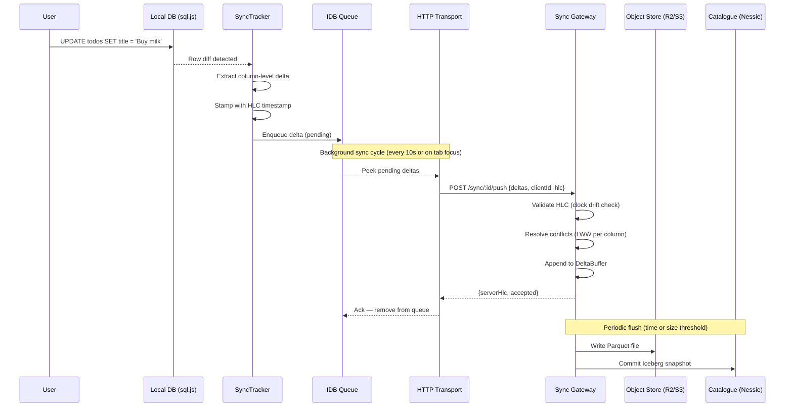
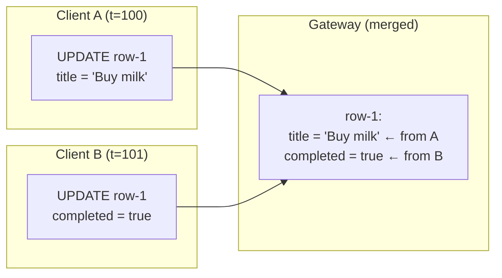
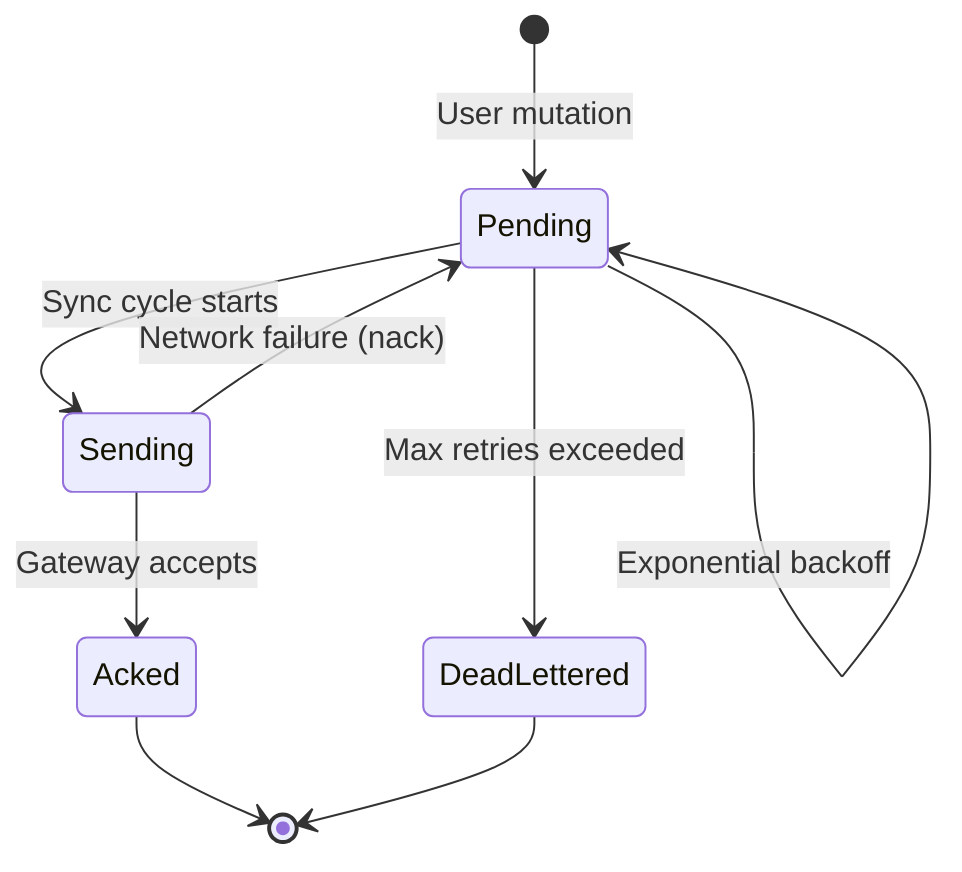
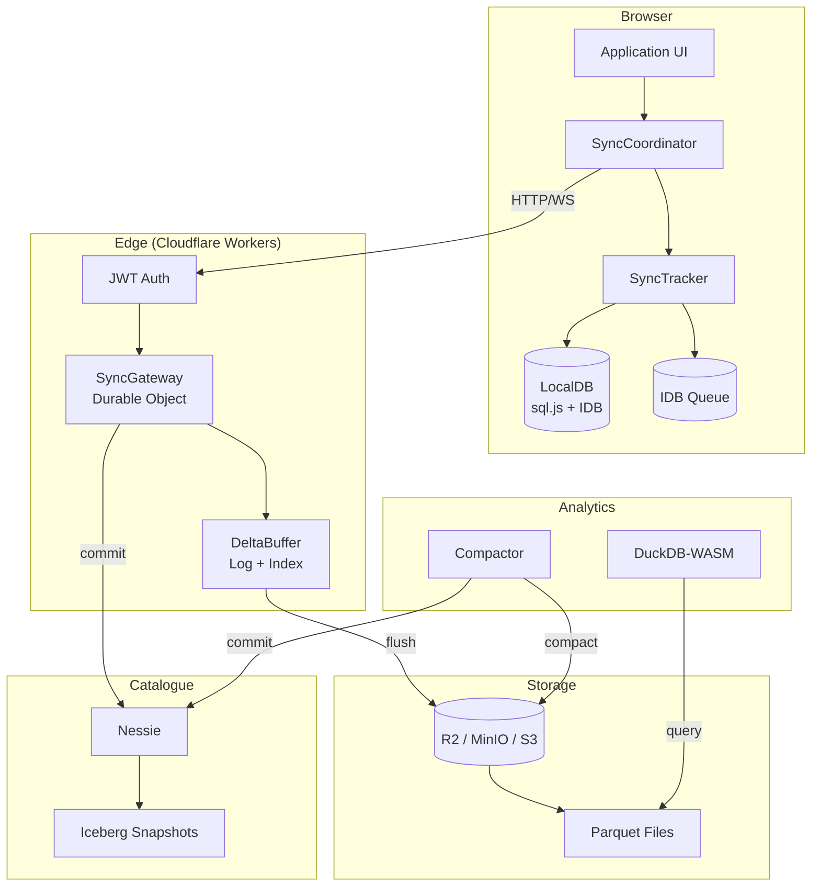

# LakeSync

[](https://github.com/radekdymacz/lakesync/actions/workflows/ci.yml)
[](https://opensource.org/licenses/Apache-2.0)

**Offline-first sync engine for browser apps — tracks column-level changes locally and lands them as Parquet in an Iceberg lakehouse.**

LakeSync synchronises data between browser clients and a shared lakehouse backend. Instead of syncing entire rows, it tracks changes at the **column level** — so when one user edits a title and another marks a task complete, both changes merge cleanly without conflict. Data flows through a sync gateway into **Apache Parquet files** managed by an **Iceberg-compatible catalogue**, giving you a full audit trail and time-travel queries out of the box.

## Why LakeSync?

Most sync engines force a choice: real-time collaboration (Firebase, Supabase) **or** analytical power (data lakes). LakeSync bridges that gap.

| | Traditional Sync | Data Lake | LakeSync |
|---|---|---|---|
| Offline-first | Yes | No | **Yes** |
| Column-level conflict resolution | Rarely | N/A | **Yes** |
| Data lands in Parquet/Iceberg | No | Yes | **Yes** |
| Time-travel queries | No | Yes | **Yes** |
| Runs on the edge (CF Workers) | Sometimes | No | **Yes** |

**The key insight:** every client mutation is a _delta_ — a small, timestamped change to specific columns. These deltas are the sync protocol, the conflict resolution input, _and_ the data lake records. One data model serves three purposes.

## How It Works

### The Journey of a Single Change

When a user edits a field in the browser, here's what happens:



### Column-Level Conflict Resolution

Traditional sync engines resolve conflicts at the row level — if two users edit the same row, one wins and the other loses. LakeSync resolves at the **column level** using Last-Write-Wins (LWW) with Hybrid Logical Clocks:



Both changes are preserved because they touch different columns. The HLC timestamp determines the winner only when two clients modify the _same_ column.

### Offline-First Sync Cycle

The client works fully offline. Mutations queue in IndexedDB and sync when connectivity returns:



Failed pushes use exponential backoff (1s, 2s, 4s... capped at 30s) and are dead-lettered after 10 retries to prevent queue starvation.

## Architecture



### Key Design Decisions

- **HLC timestamps** (branded bigints) — 48-bit wall clock + 16-bit counter, giving monotonic ordering across distributed clients without coordination
- **Deterministic delta IDs** — SHA-256 hash of `(clientId, hlc, table, rowId, columns)` enables idempotent push
- **DeltaBuffer** — dual structure (append log for ordering + row index for conflict resolution) gives O(1) conflict checks and O(n) flush
- **Result\<T, E\>** everywhere — no exceptions cross API boundaries; all errors are typed and composable
- **Parquet as the flush format** — columnar storage is a natural fit for column-level deltas, and Iceberg gives you schema evolution + time travel for free

## Quick Start

### Install

```bash
npm install @lakesync/client @lakesync/core
```

### Sync in 10 Lines

```typescript
import { LocalDB, SyncCoordinator, HttpTransport } from "@lakesync/client";

const db = await LocalDB.open({ name: "my-app", backend: "idb" });

const transport = new HttpTransport({
  baseUrl: "https://your-gateway.workers.dev",
  gatewayId: "my-gateway",
  token: "your-jwt-token",
});

const coordinator = new SyncCoordinator(db, transport);
coordinator.startAutoSync();

// Track mutations — deltas are extracted and queued automatically
await coordinator.tracker.insert("todos", "row-1", {
  title: "Buy milk",
  completed: 0,
});
```

### Run Locally

```bash
git clone https://github.com/radekdymacz/lakesync.git
cd lakesync
bun install
bun run build
bun run test
```

### Deploy the Gateway

```bash
cd apps/gateway-worker
wrangler r2 bucket create lakesync-data  # once
wrangler deploy
```

See the [Todo App](apps/examples/todo-app/) for a complete working example, or the [Gateway Worker README](apps/gateway-worker/README.md) for deployment details.

## Packages

| Package | Description |
|---------|-------------|
| [`@lakesync/core`](packages/core) | HLC timestamps, delta types, LWW conflict resolution, Result type |
| [`@lakesync/client`](packages/client) | Client SDK: SyncCoordinator, SyncTracker, HTTP + local transports, IDB queue & persistence |
| [`@lakesync/gateway`](packages/gateway) | Sync gateway with delta buffer, conflict resolution, Parquet/JSON flush |
| [`@lakesync/adapter`](packages/adapter) | Storage adapter interface + MinIO/S3 implementation |
| [`@lakesync/proto`](packages/proto) | Protobuf codec for the wire protocol |
| [`@lakesync/parquet`](packages/parquet) | Parquet read/write via parquet-wasm |
| [`@lakesync/catalogue`](packages/catalogue) | Iceberg REST catalogue client (Nessie-compatible) |
| [`@lakesync/compactor`](packages/compactor) | Parquet compaction + equality delete files |
| [`@lakesync/analyst`](packages/analyst) | Time-travel queries + analytics via DuckDB-WASM |

| App | Description |
|-----|-------------|
| [`gateway-worker`](apps/gateway-worker) | Cloudflare Workers deployment: Durable Object gateway, R2 storage, JWT auth |
| [`todo-app`](apps/examples/todo-app) | Reference implementation: offline-first todo list with column-level sync |

## Contributing

See [CONTRIBUTING.md](CONTRIBUTING.md) for development setup and contribution guidelines.

## Licence

Licensed under the [Apache Licence 2.0](LICENSE).
