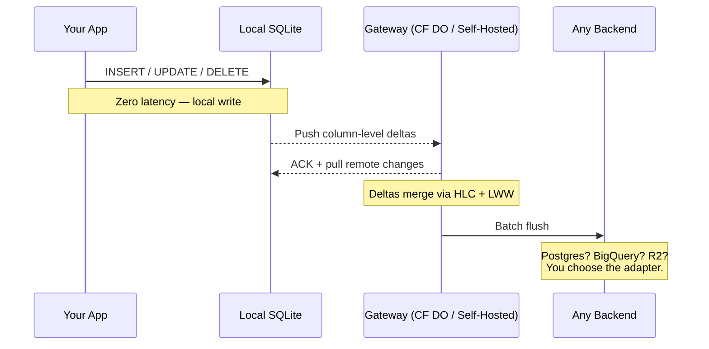
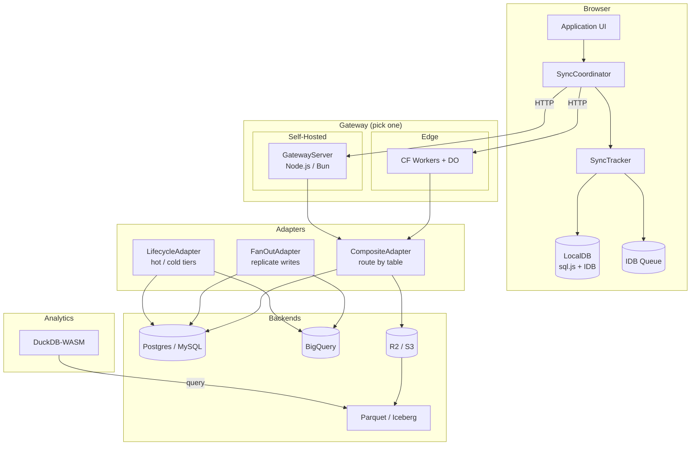

# LakeSync

[](https://github.com/radekdymacz/lakesync/actions/workflows/ci.yml)
[](https://opensource.org/licenses/Apache-2.0)

**Local-first sync. Any backend.**

LakeSync is an open-source sync engine for local-first TypeScript apps. Your data lives in SQLite on the device, syncs through a lightweight gateway, and flushes to the backend of your choice — **Postgres for small data, BigQuery for analytics, S3/R2 via Apache Iceberg for large data**. Same client code either way.

**[Documentation](https://radekdymacz.github.io/lakesync)** · **[Getting Started](https://radekdymacz.github.io/lakesync/docs/getting-started)** · **[Architecture](https://radekdymacz.github.io/lakesync/docs/architecture)**

## Why LakeSync?

Most sync engines lock you into a single backend. LakeSync's `LakeAdapter` interface decouples sync from storage — swap backends without changing client code.

| | Traditional Sync | Data Lake | LakeSync |
|---|---|---|---|
| Offline-first | Yes | No | **Yes** |
| Column-level conflict resolution | Rarely | N/A | **Yes** |
| Pluggable backend | No | No | **Yes** |
| Small data (Postgres/MySQL) | Yes | No | **Yes** |
| Analytics (BigQuery) | Sometimes | Sometimes | **Yes** |
| Large data (Iceberg/S3/R2) | No | Yes | **Yes** |
| Time-travel queries | No | Yes | **Yes** |
| Self-hosted or edge (CF Workers) | Sometimes | No | **Yes** |

## How It Works



1. **Mutations write to local SQLite** with zero latency
2. **Column-level deltas push** to a lightweight gateway
3. **Gateway merges** via Hybrid Logical Clocks — concurrent edits to different columns are both preserved
4. **Batch flush** to whatever backend you choose via the adapter interface

## Right-Size Your Backend

### Small data — use what you know

```
Client SQLite → Gateway → Postgres / MySQL / RDS
```

Familiar tooling, standard SQL queries, simple operational model. The `PostgresAdapter` or `MySQLAdapter` flushes deltas directly to your database.

### Large data — scale to the lake

```
Client SQLite → Gateway → Apache Iceberg (S3/R2)
```

Infinite scale on object storage. Operational data and analytics data are the same thing. Query with Spark, DuckDB, Athena, Trino — zero ETL.

### Mix both — route by table

```typescript
const adapter = new CompositeAdapter({
  routes: [
    { tables: ["users", "settings"], adapter: postgresAdapter },
    { tables: ["events", "telemetry"], adapter: icebergAdapter },
  ],
  defaultAdapter: postgresAdapter,
});
```

The `CompositeAdapter` routes deltas to different backends by table name. When your data outgrows one backend, `migrateAdapter()` moves it to another — idempotent and safe to re-run.

### Replicate — fan out writes

```typescript
const adapter = new FanOutAdapter({
  primary: postgresAdapter,         // sync — fast operational reads/writes
  secondaries: [bigqueryAdapter],   // async — best-effort analytics replica
});
```

The `FanOutAdapter` writes to a primary adapter synchronously and replicates to secondaries in the background. Secondary failures never block the write path.

### Tier — age-based lifecycle

```typescript
const adapter = new LifecycleAdapter({
  hot: { adapter: postgresAdapter, maxAgeMs: 30 * 24 * 60 * 60 * 1000 }, // 30 days
  cold: { adapter: bigqueryAdapter },
});
```

Recent data stays in the hot tier for fast queries. Older data is served from the cold tier. Call `migrateToTier()` on a schedule to move aged-out deltas.

## Column-Level Conflict Resolution

Traditional sync engines resolve conflicts at the row level — if two users edit the same row, one wins. LakeSync resolves at the **column level** using Last-Write-Wins with Hybrid Logical Clocks:


Both changes are preserved because they touch different columns. The HLC timestamp determines the winner only when two clients modify the _same_ column.

## Offline-First

The full dataset lives in local SQLite. Edits queue in a persistent IndexedDB outbox that survives page refreshes and browser crashes. When connectivity returns, the outbox drains automatically.


## Sync Rules

Declarative bucket-based filtering with JWT claim references. The gateway evaluates rules at pull time — clients never download data they shouldn't see. Supports operators: `eq`, `neq`, `in`, `gt`, `lt`, `gte`, `lte`.

```json
{
  "buckets": [{
    "name": "user-data",
    "filters": [
      { "column": "user_id", "op": "eq", "value": "jwt:sub" },
      { "column": "priority", "op": "gte", "value": "3" }
    ],
    "tables": ["todos", "preferences"]
  }]
}
```

## Quick Start

### Install

```bash
npm install lakesync
```

### Sync in 10 Lines

```typescript
import { LocalDB, SyncCoordinator, HttpTransport } from "lakesync/client";

const db = await LocalDB.open({ name: "my-app", backend: "idb" });

const transport = new HttpTransport({
  baseUrl: "https://your-gateway.workers.dev",
  gatewayId: "my-gateway",
  token: "your-jwt-token",
});

const coordinator = new SyncCoordinator(db, transport);
coordinator.startAutoSync();

// Track mutations — deltas are extracted and queued automatically
await coordinator.tracker.insert("todos", "row-1", {
  title: "Buy milk",
  completed: 0,
});
```

### Run Locally

```bash
git clone https://github.com/radekdymacz/lakesync.git
cd lakesync
bun install
bun run build
bun run test
```

### Deploy the Gateway

**Cloudflare Workers (edge):**

```bash
cd apps/gateway-worker
wrangler r2 bucket create lakesync-data  # once
wrangler deploy
```

**Self-hosted (Node.js / Bun):**

```typescript
import { GatewayServer } from "@lakesync/gateway-server";
import { PostgresAdapter } from "@lakesync/adapter";

const adapter = new PostgresAdapter({ connectionString: "postgres://..." });
const server = new GatewayServer({
  port: 3000,
  gatewayId: "my-gateway",
  adapter,
  jwtSecret: "your-secret",
  persistence: "sqlite", // survive restarts
});
server.start();
```

Or use Docker:

```bash
cd packages/gateway-server
docker compose up
```

See the [Todo App](apps/examples/todo-app/) for a complete working example.

## Architecture



### Key Design Decisions

- **Pluggable adapters** — `LakeAdapter` (object storage) and `DatabaseAdapter` (SQL) interfaces. Swap backends at the gateway level.
- **HLC timestamps** (branded bigints) — 48-bit wall clock + 16-bit counter, monotonic ordering across distributed clients without coordination
- **Deterministic delta IDs** — SHA-256 hash of `(clientId, hlc, table, rowId, columns)` enables idempotent push
- **DeltaBuffer** — dual structure (append log + row index) gives O(1) conflict checks and O(n) flush
- **Result\<T, E\>** everywhere — no exceptions cross API boundaries; all errors are typed and composable
- **Adapter composition** — `CompositeAdapter` (route by table), `FanOutAdapter` (replicate writes), `LifecycleAdapter` (hot/cold tiers). All implement `DatabaseAdapter` so they nest freely.
- **Table sharding** — split a tenant's traffic across multiple Durable Objects by table name. The shard router fans out pushes and merges pull results automatically.
- **Adapter-sourced pull** — clients can pull directly from named source adapters (e.g. a BigQuery dataset) via the gateway, with sync rules filtering applied.

## Packages

| Package | Description |
|---------|-------------|
| [`@lakesync/core`](packages/core) | HLC timestamps, delta types, LWW conflict resolution, sync rules, Result type |
| [`@lakesync/client`](packages/client) | Client SDK: SyncCoordinator, SyncTracker, LocalDB, transports, queues, initial sync |
| [`@lakesync/gateway`](packages/gateway) | Sync gateway with delta buffer, conflict resolution, adapter-sourced pull, dual-adapter flush |
| [`@lakesync/gateway-server`](packages/gateway-server) | Self-hosted gateway server (Node.js / Bun) with SQLite persistence and JWT auth |
| [`@lakesync/adapter`](packages/adapter) | Storage adapters: MinIO/S3, Postgres, MySQL, BigQuery, Composite, FanOut, Lifecycle, migration tooling |
| [`@lakesync/proto`](packages/proto) | Protobuf codec for the wire protocol |
| [`@lakesync/parquet`](packages/parquet) | Parquet read/write via parquet-wasm |
| [`@lakesync/catalogue`](packages/catalogue) | Iceberg REST catalogue client (Nessie-compatible) |
| [`@lakesync/compactor`](packages/compactor) | Parquet compaction, equality deletes, checkpoint generation |
| [`@lakesync/analyst`](packages/analyst) | Time-travel queries + analytics via DuckDB-WASM |
| [`lakesync`](packages/lakesync) | Unified package with subpath exports for all of the above |

| App | Description |
|-----|-------------|
| [`gateway-worker`](apps/gateway-worker) | Cloudflare Workers: Durable Object gateway, R2 storage, JWT auth, sync rules, table sharding |
| [`todo-app`](apps/examples/todo-app) | Reference implementation: offline-first todo list with column-level sync |
| [`docs`](apps/docs) | Documentation site (Fumadocs + Next.js) |

## Backend Support

| Backend | Adapter | Status |
|---------|---------|--------|
| Cloudflare R2 | `LakeAdapter` (MinIO-compatible) | Production-ready |
| AWS S3 | `LakeAdapter` (MinIO-compatible) | Production-ready |
| MinIO | `LakeAdapter` | Production-ready |
| PostgreSQL | `DatabaseAdapter` (PostgresAdapter) | Implemented |
| MySQL | `DatabaseAdapter` (MySQLAdapter) | Implemented |
| BigQuery | `DatabaseAdapter` (BigQueryAdapter) | Implemented |
| Composite (route by table) | `CompositeAdapter` | Implemented |
| Fan-out (replicate writes) | `FanOutAdapter` | Implemented |
| Lifecycle (hot/cold tiers) | `LifecycleAdapter` | Implemented |

## Status

Experimental, but real. All planned phases are implemented and tested: core sync engine, conflict resolution, client SDK, Cloudflare Workers gateway, self-hosted gateway server, compaction, checkpoint generation, sync rules (with extended comparison operators), initial sync, database adapters (Postgres, MySQL, BigQuery), composite routing, fan-out replication, lifecycle tiering, table sharding, and adapter-sourced pull. API is not yet stable — expect breaking changes.

## Contributing

See [CONTRIBUTING.md](CONTRIBUTING.md) for development setup and contribution guidelines.

## Licence

Licensed under the [Apache Licence 2.0](LICENSE).
