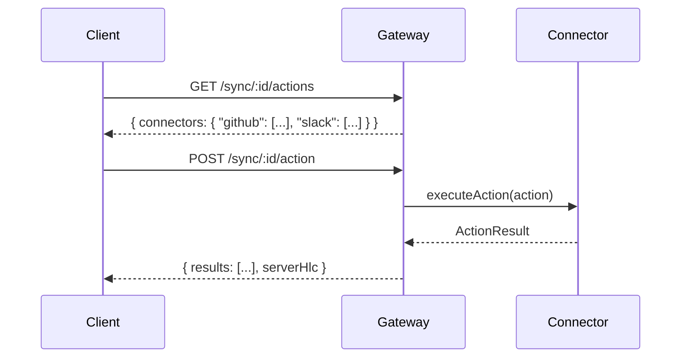

## Overview

Actions let clients execute imperative operations against external systems through the gateway. Instead of syncing data, actions trigger side effects — creating a pull request on GitHub, sending a Slack message, or updating a Jira ticket.

Actions flow through registered **ActionHandlers** on the gateway. Each handler declares which action types it supports via **ActionDescriptors**, and clients can discover available actions at runtime via the discovery endpoint.



## Action Discovery

Before executing actions, clients can discover which connectors and action types are available. This enables frontends to build UI dynamically — no hardcoded connector names or action types.

### Route

```
GET /sync/:gatewayId/actions
```

**Headers:** `Authorization: Bearer <JWT>` (same auth as push/pull — not an admin route)

**Response:**

```json
{
  "connectors": {
    "github": [
      { "actionType": "create_pr", "description": "Create a pull request", "paramsSchema": { ... } }
    ],
    "slack": [
      { "actionType": "send_message", "description": "Send a message" }
    ]
  }
}
```

When no action handlers are registered, `connectors` is an empty object.

**Example:**

```bash
curl https://gateway.example.com/sync/my-gw/actions \
  -H "Authorization: Bearer $TOKEN"
```

### Client SDK

Both `HttpTransport` and `LocalTransport` implement the optional `describeActions()` method:

```ts
const transport = new HttpTransport({
  baseUrl: "https://gateway.example.com",
  gatewayId: "my-gw",
  token: "...",
});

const result = await transport.describeActions();
if (result.ok) {
  // result.value.connectors is Record<string, ActionDescriptor[]>
  for (const [connector, actions] of Object.entries(result.value.connectors)) {
    console.log(`${connector}:`, actions.map(a => a.actionType));
  }
}
```

## Executing Actions

Send one or more actions to the gateway via the action endpoint. The gateway dispatches each action to the matching ActionHandler by connector name.

### Route

```
POST /sync/:gatewayId/action
```

**Headers:** `Authorization: Bearer <JWT>`

**Body:**

```json
{
  "clientId": "client-1",
  "actions": [
    {
      "actionId": "unique-id",
      "clientId": "client-1",
      "hlc": "12345",
      "connector": "slack",
      "actionType": "send_message",
      "params": { "channel": "#general", "text": "Hello from LakeSync" },
      "idempotencyKey": "optional-dedup-key"
    }
  ]
}
```

**Response:**

```json
{
  "results": [
    {
      "actionId": "unique-id",
      "data": { "messageId": "msg-123", "sent": true },
      "serverHlc": "67890"
    }
  ],
  "serverHlc": "67890"
}
```

### Client SDK

```ts
const result = await transport.executeAction({
  clientId: "client-1",
  actions: [{
    actionId: "a1",
    clientId: "client-1",
    hlc: hlc.now(),
    connector: "slack",
    actionType: "send_message",
    params: { channel: "#general", text: "Hello" },
  }],
});
```

## Types

### `Action`

```ts
interface Action {
  /** Unique action identifier (deterministic SHA-256 hash). */
  actionId: string;
  /** Client that initiated the action. */
  clientId: string;
  /** HLC timestamp when the action was created. */
  hlc: HLCTimestamp;
  /** Target connector name (e.g. "github", "slack"). */
  connector: string;
  /** Action type within the connector (e.g. "create_pr", "send_message"). */
  actionType: string;
  /** Action parameters — connector-specific payload. */
  params: Record<string, unknown>;
  /** Optional idempotency key for at-most-once delivery. */
  idempotencyKey?: string;
}
```

### `ActionDescriptor`

```ts
interface ActionDescriptor {
  /** The action type identifier. */
  actionType: string;
  /** Human-readable description. */
  description: string;
  /** Optional JSON Schema for the action's params. */
  paramsSchema?: Record<string, unknown>;
}
```

### `ActionDiscovery`

```ts
interface ActionDiscovery {
  /** Map of connector name to its supported action descriptors. */
  connectors: Record<string, ActionDescriptor[]>;
}
```

### `ActionResult` / `ActionErrorResult`

```ts
interface ActionResult {
  actionId: string;
  data: Record<string, unknown>;
  serverHlc: HLCTimestamp;
}

interface ActionErrorResult {
  actionId: string;
  code: string;
  message: string;
  retryable: boolean;
}
```

### `ActionPush` / `ActionResponse`

```ts
interface ActionPush {
  clientId: string;
  actions: Action[];
}

interface ActionResponse {
  results: Array<ActionResult | ActionErrorResult>;
  serverHlc: HLCTimestamp;
}
```

## Implementing an ActionHandler

Connectors that support actions implement the `ActionHandler` interface:

```ts
interface ActionHandler {
  /** Descriptors for all action types this handler supports. */
  readonly supportedActions: ActionDescriptor[];
  /** Execute a single action against the external system. */
  executeAction(
    action: Action,
    context?: AuthContext,
  ): Promise<Result<ActionResult, ActionExecutionError>>;
}

interface AuthContext {
  claims: ResolvedClaims;
}
```

**Example:**

```ts
const slackHandler: ActionHandler = {
  supportedActions: [
    { actionType: "send_message", description: "Send a message to a Slack channel" },
  ],
  async executeAction(action, context) {
    const { channel, text } = action.params as { channel: string; text: string };
    // Call the Slack API...
    return Ok({
      actionId: action.actionId,
      data: { sent: true, channel },
      serverHlc: 0n as HLCTimestamp,
    });
  },
};
```

Register the handler on the gateway:

```ts
gateway.registerActionHandler("slack", slackHandler);
```

Database adapters that implement `ActionHandler` are auto-registered when added as connectors via the admin API.

## Idempotency

Actions support two levels of deduplication:

1. **`actionId`** — The gateway tracks executed action IDs. Re-submitting the same `actionId` returns the cached result without re-executing.
2. **`idempotencyKey`** — An optional client-provided key. Different actions with the same `idempotencyKey` return the first result.

Retryable errors (e.g. rate limits) are **not** cached — the client can retry with the same `actionId` and the action will be re-executed.

## Error Handling

| Error Code | Meaning | Retryable |
|-----------|---------|-----------|
| `ACTION_VALIDATION_ERROR` | Malformed action (empty fields) | No |
| `ACTION_NOT_SUPPORTED` | No handler for connector or action type | No |
| `ACTION_EXECUTION_ERROR` | Handler returned an error | Depends on handler |

Validation errors (`ACTION_VALIDATION_ERROR`) fail the entire batch. Execution errors are returned per-action in the `results` array so other actions in the batch can still succeed.

## Gateway Registration

### Programmatic

```ts
// Register
gateway.registerActionHandler("github", githubHandler);

// List registered connector names
gateway.listActionHandlers(); // ["github"]

// Discover all handlers and their supported actions
gateway.describeActions();
// { connectors: { github: [{ actionType: "create_pr", description: "..." }] } }

// Unregister
gateway.unregisterActionHandler("github");
```

### Via Config

```ts
const gateway = new SyncGateway({
  gatewayId: "my-gw",
  maxBufferBytes: 4 * 1024 * 1024,
  maxBufferAgeMs: 30_000,
  actionHandlers: {
    github: githubHandler,
    slack: slackHandler,
  },
});
```

## Security

- The discovery route (`GET /sync/:id/actions`) uses the same authentication as push/pull — any authenticated client can discover available actions.
- The action execution route (`POST /sync/:id/action`) also uses standard client auth.
- The optional `AuthContext` (JWT claims) is forwarded to `executeAction()` so handlers can perform fine-grained permission checks.
- Neither route requires admin role.
