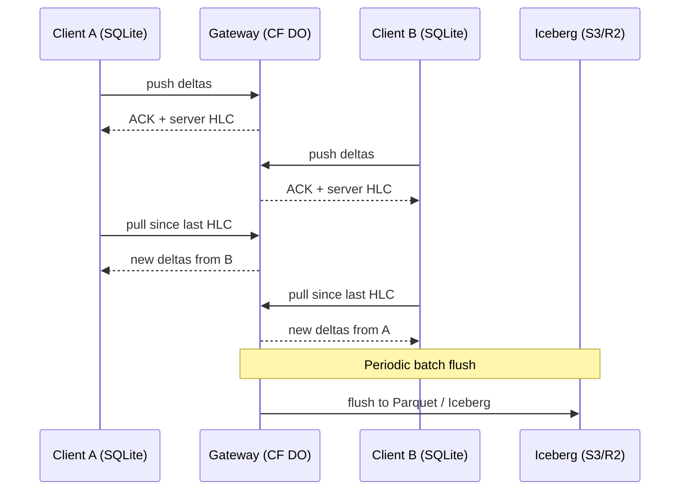
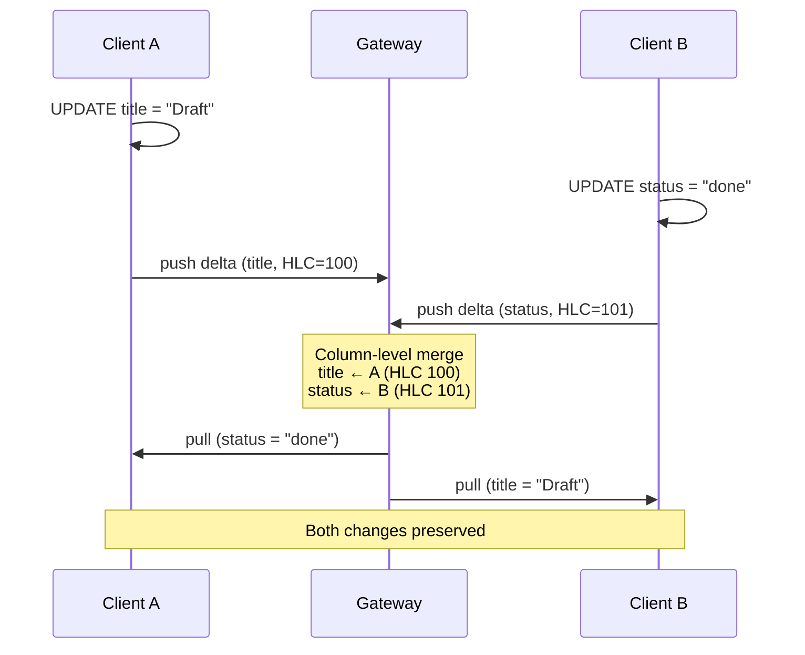
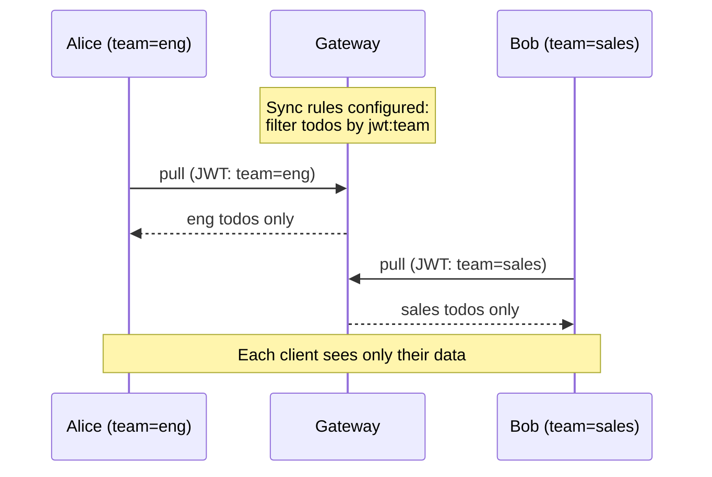
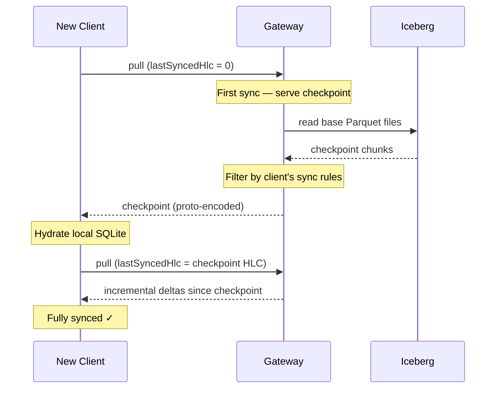

## Overview

LakeSync is a monorepo containing 10 packages and 2 apps. The core sync loop follows a **push/pull** model where clients push local deltas to a gateway and pull remote deltas back.



## Hybrid Logical Clocks (HLC)

Every mutation is timestamped with an `HLCTimestamp` — a branded `bigint` encoding 48 bits of wall-clock time and 16 bits of a monotonic counter. This provides:

- **Causal ordering** across clients without centralised coordination
- **Deterministic tiebreaking** — when timestamps are equal, the higher `clientId` wins
- **Compact representation** — a single 64-bit value instead of a timestamp + counter pair

```ts
import { HLC, type HLCTimestamp } from "lakesync";

const hlc = new HLC();
const ts: HLCTimestamp = hlc.now();
```

## Delta Model

A **Delta** represents a single mutation to a single row. Rather than storing full row snapshots, LakeSync stores _column-level_ changes:

```ts
interface Delta {
  deltaId: string;       // SHA-256 of stable-stringified payload
  table: string;
  rowId: string;
  columns: Record<string, unknown>;
  hlc: HLCTimestamp;
  clientId: string;
}
```

Deterministic `deltaId` generation ensures that the same logical change always produces the same identifier, enabling idempotent processing.

## Conflict Resolution

LakeSync uses **column-level last-writer-wins (LWW)**:

1. For each column in a delta, compare the incoming HLC with the stored HLC for that column
2. If the incoming HLC is greater, the incoming value wins
3. If HLCs are equal, the higher `clientId` wins (deterministic tiebreak)
4. Columns not present in the incoming delta are left untouched

This means two clients can edit different columns of the same row concurrently without either change being lost.



## Result Pattern

Public APIs never throw. Instead, they return `Result<T, E>`:

```ts
import { ok, err, type Result } from "lakesync";

function divide(a: number, b: number): Result<number, string> {
  if (b === 0) return err("Division by zero");
  return ok(a / b);
}

const result = divide(10, 2);
if (result.ok) {
  console.log(result.value); // 5
} else {
  console.error(result.error);
}
```

## DeltaBuffer

The gateway stores deltas in a `DeltaBuffer` — a dual data structure with:

- **Log** — an append-only array of deltas in insertion order (for pull)
- **Index** — a map from `table:rowId` to the latest delta per column (for conflict resolution)

## Sync Rules

Sync rules define which data each client can see. Rules are organised into **buckets** with `eq` and `in` operators:

```json
{
  "buckets": [{
    "name": "user-data",
    "filters": [
      { "column": "user_id", "op": "eq", "value": "jwt:sub" }
    ],
    "tables": ["todos", "preferences"]
  }]
}
```

The `jwt:` prefix references claims from the client's JWT token. At pull time, the gateway evaluates sync rules against the client's token claims and returns only matching deltas.



## Checkpoints

For initial sync (when `lastSyncedHlc === 0`), the client downloads a **checkpoint** — a complete snapshot of the current state. Checkpoints are:

- Generated post-compaction from base Parquet files
- Encoded as Protocol Buffer chunks, one per table
- Sized to a byte budget (default 16 MB per chunk)
- Filtered at serve time using the client's sync rules (the stored checkpoint contains all rows)


