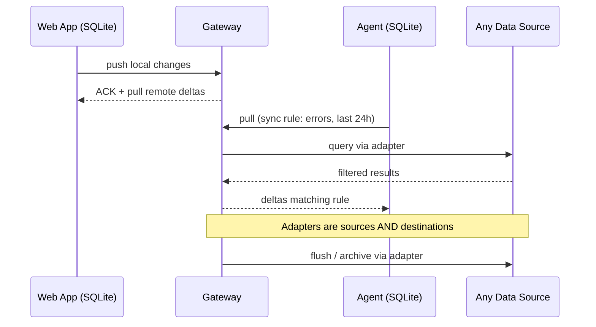
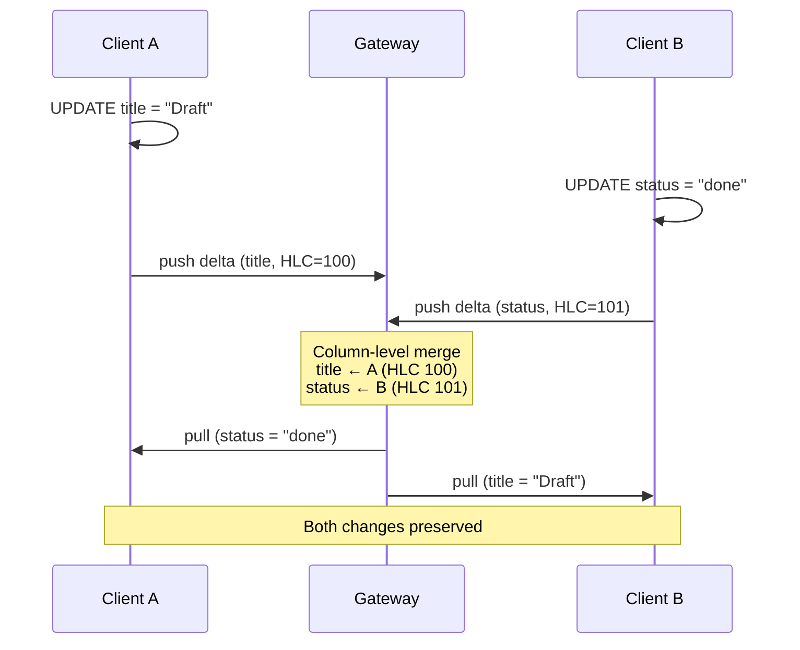
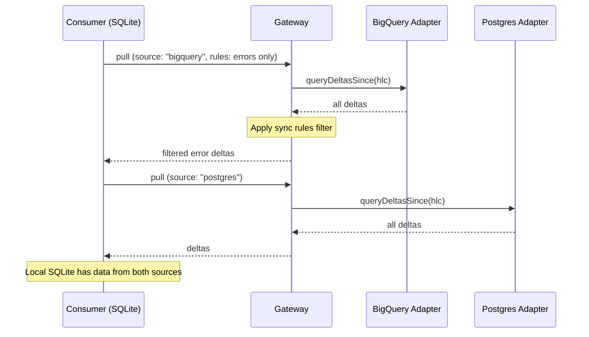
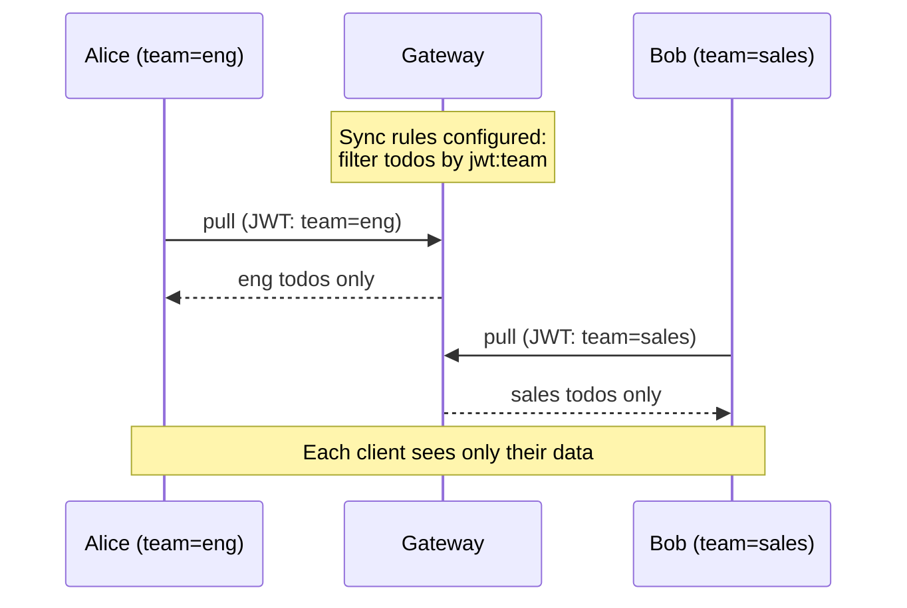
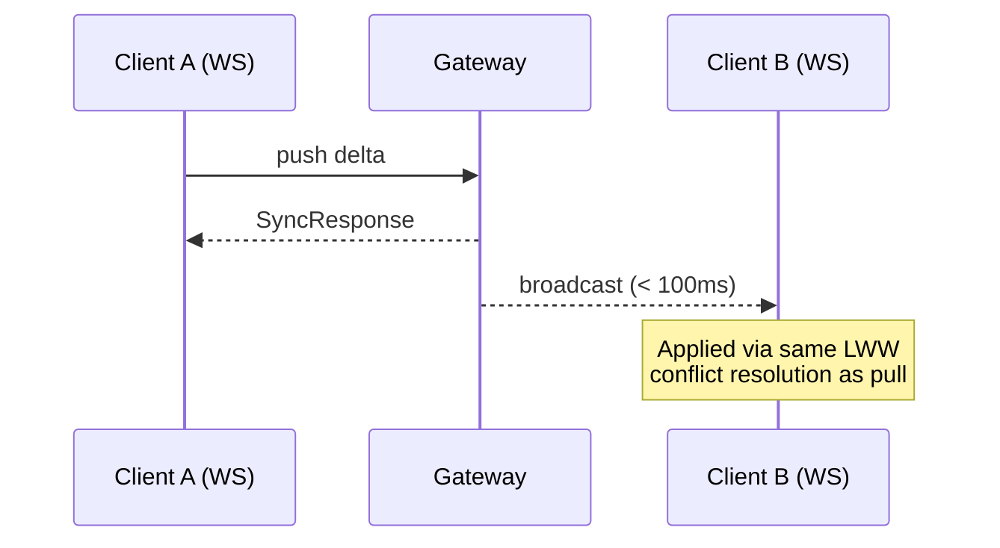
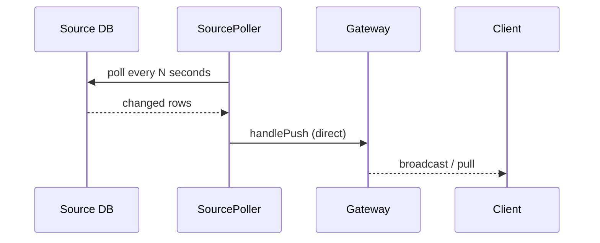
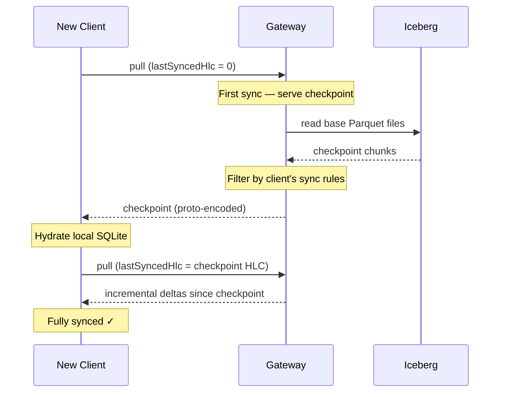

## Overview

LakeSync syncs any data source to a local working set. The core loop follows a **push/pull** model where consumers (web apps, AI agents) push local changes and pull filtered subsets from remote sources via the gateway.



## Adapters

Any data source you can read from becomes a LakeSync adapter. Adapters are both sources and destinations — enabling bidirectional sync and cross-backend flows.

| Adapter | Interface | Use case |
|---------|-----------|----------|
| **Postgres / MySQL** | `DatabaseAdapter` | Operational OLTP data, familiar SQL tooling |
| **BigQuery** | `DatabaseAdapter` | Analytics-scale queries, managed and serverless |
| **S3 / R2 (Iceberg)** | `LakeAdapter` | Massive scale on object storage, open format |
| **Jira Cloud** | API Connector | Sync issues, comments, and projects from Jira |
| **Anything else** | Either interface | CloudWatch, Stripe, custom APIs — implement the interface |

The `DatabaseAdapter` interface (`insertDeltas`, `queryDeltasSince`, `getLatestState`, `ensureSchema`) handles SQL-like sources. The `LakeAdapter` interface (`putObject`, `getObject`, `listObjects`, `deleteObject`) handles object storage. The `CompositeAdapter` routes data to multiple backends simultaneously.

## Hybrid Logical Clocks (HLC)

Every mutation is timestamped with an `HLCTimestamp` — a branded `bigint` encoding 48 bits of wall-clock time and 16 bits of a monotonic counter. This provides:

- **Causal ordering** across clients without centralised coordination
- **Deterministic tiebreaking** — when timestamps are equal, the higher `clientId` wins
- **Compact representation** — a single 64-bit value instead of a timestamp + counter pair

```ts
import { HLC, type HLCTimestamp } from "lakesync";

const hlc = new HLC();
const ts: HLCTimestamp = hlc.now();
```

## Delta Model

A **Delta** represents a single mutation to a single row. Rather than storing full row snapshots, LakeSync stores _column-level_ changes:

```ts
interface Delta {
  deltaId: string;       // SHA-256 of stable-stringified payload
  table: string;
  rowId: string;
  columns: Record<string, unknown>;
  hlc: HLCTimestamp;
  clientId: string;
}
```

Deterministic `deltaId` generation ensures that the same logical change always produces the same identifier, enabling idempotent processing.

## Conflict Resolution

LakeSync uses **column-level last-writer-wins (LWW)**:

1. For each column in a delta, compare the incoming HLC with the stored HLC for that column
2. If the incoming HLC is greater, the incoming value wins
3. If HLCs are equal, the higher `clientId` wins (deterministic tiebreak)
4. Columns not present in the incoming delta are left untouched

This means two clients can edit different columns of the same row concurrently without either change being lost.



## Result Pattern

Public APIs never throw. Instead, they return `Result<T, E>`:

```ts
import { ok, err, type Result } from "lakesync";

function divide(a: number, b: number): Result<number, string> {
  if (b === 0) return err("Division by zero");
  return ok(a / b);
}

const result = divide(10, 2);
if (result.ok) {
  console.log(result.value); // 5
} else {
  console.error(result.error);
}
```

## DeltaBuffer

The gateway stores deltas in a `DeltaBuffer` — a dual data structure with:

- **Log** — an append-only array of deltas in insertion order (for pull)
- **Index** — a map from `table:rowId` to the latest delta per column (for conflict resolution)

## Adapter-Sourced Pull

The gateway can pull data from named source adapters in addition to its in-memory buffer. A consumer declares what it needs (e.g. "give me errors from the last 24h from BigQuery") and the gateway queries the adapter, applies sync rules, and returns filtered deltas.

```ts
// Client-side: pull from a named source adapter
const coordinator = new SyncCoordinator(db, transport);
await coordinator.pullFrom("bigquery");
```



Source adapters are registered on the gateway via `sourceAdapters` in `GatewayConfig`. The `source` field on `SyncPull` selects which adapter to query. When omitted, the existing in-memory buffer path is used (backwards compatible).

## Sync Rules

Sync rules define which data each client can see. Rules are organised into **buckets** with filter operators:

| Operator | Description | Example |
|----------|-------------|---------|
| `eq` | Equals (exact match) | `{ "op": "eq", "value": "jwt:sub" }` |
| `in` | Contained in (multi-value) | `{ "op": "in", "value": "jwt:roles" }` |
| `neq` | Not equals | `{ "op": "neq", "value": "archived" }` |
| `gt` | Greater than | `{ "op": "gt", "value": "100" }` |
| `lt` | Less than | `{ "op": "lt", "value": "50" }` |
| `gte` | Greater than or equal | `{ "op": "gte", "value": "0" }` |
| `lte` | Less than or equal | `{ "op": "lte", "value": "1000" }` |

Comparison operators (`gt`, `lt`, `gte`, `lte`) use numeric comparison when both values parse as numbers, falling back to string comparison via `localeCompare()`.

```json
{
  "buckets": [{
    "name": "user-data",
    "filters": [
      { "column": "user_id", "op": "eq", "value": "jwt:sub" }
    ],
    "tables": ["todos", "preferences"]
  }]
}
```

The `jwt:` prefix references claims from the client's JWT token. At pull time, the gateway evaluates sync rules against the client's token claims and returns only matching deltas.



## Real-Time Sync

When a client pushes deltas, the gateway broadcasts them to all other connected WebSocket clients immediately — filtered by each client's sync rules. HTTP polling remains as a fallback.



The `WebSocketTransport` uses the same binary protobuf protocol as HTTP with tag-based framing (`0x01` push, `0x02` pull, `0x03` broadcast). It reconnects automatically on disconnect with exponential backoff. When realtime is active, polling drops to a 60-second heartbeat to catch missed deltas.

See [Real-Time Sync](/docs/real-time) for setup and configuration details.

## Source Polling Ingest

External databases (Neon, Postgres, MySQL) and APIs (Jira) may have data written by services outside LakeSync. The **Source Polling Ingest** system bridges that gap — it periodically queries source tables or APIs, detects changes, and pushes them through the gateway as deltas.



Two change detection strategies are available for database sources: **cursor** (fast, requires a monotonically increasing column like `updated_at`) and **diff** (slower, detects hard deletes via full-table comparison). API connectors like Jira use their own strategies internally. All pollers run inside `GatewayServer` — no HTTP hop, no auth needed. Detected changes flow through the same conflict resolution and sync rules as client-originated deltas.

See [Source Polling Ingest](/docs/source-polling) for database polling setup and [Dynamic Connectors](/docs/connectors) for API connectors like Jira.

## Checkpoints

For initial sync (when `lastSyncedHlc === 0`), the client downloads a **checkpoint** — a complete snapshot of the current state. Checkpoints are:

- Generated post-compaction from base Parquet files
- Encoded as Protocol Buffer chunks, one per table
- Sized to a byte budget (default 16 MB per chunk)
- Filtered at serve time using the client's sync rules (the stored checkpoint contains all rows)


