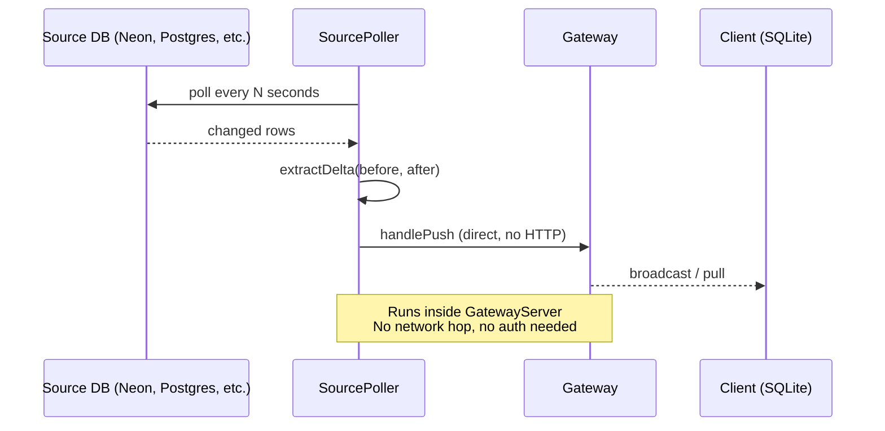

## Overview

LakeSync captures mutations from its own clients, but external databases (Neon, Postgres, MySQL) may have data written by other services. Source Polling Ingest bridges that gap — it periodically queries source tables, detects changes, converts them to deltas, and pushes them through the gateway. All connected clients then receive external data via sync rules, just like any other delta.



The poller pushes directly via `gateway.handlePush()` — no HTTP hop and no authentication required. Detected changes flow through the same conflict resolution and sync rules as client-originated deltas.

## Quick Start

```ts
import { Pool } from "pg";
import { GatewayServer } from "@lakesync/gateway-server";

const neonPool = new Pool({
  connectionString: process.env.NEON_DATABASE_URL,
});

const server = new GatewayServer({
  gatewayId: "my-gateway",
  jwtSecret: process.env.JWT_SECRET,
  persistence: "sqlite",
  ingestSources: [{
    name: "neon",
    queryFn: async (sql, params) => {
      const result = await neonPool.query(sql, params);
      return result.rows;
    },
    intervalMs: 5_000,
    tables: [
      {
        table: "users",
        query: "SELECT id, name, email, updated_at FROM users",
        rowIdColumn: "id",
        strategy: { type: "cursor", cursorColumn: "updated_at" },
      },
      {
        table: "audit_log",
        query: "SELECT id, action, payload FROM audit_log",
        rowIdColumn: "id",
        strategy: { type: "diff" },
      },
    ],
  }],
});

await server.start();
```

Pollers start automatically when the server starts and stop when the server stops.

## Change Detection Strategies

### Cursor Strategy

Fast incremental polling using a monotonically increasing column (e.g. `updated_at`, an auto-incrementing ID, or an epoch timestamp).

```ts
{
  table: "users",
  query: "SELECT id, name, email, updated_at FROM users",
  strategy: {
    type: "cursor",
    cursorColumn: "updated_at",
    lookbackMs: 5_000, // default
  },
}
```

**How it works:**

1. **First poll** — fetches all rows (initial sync), ordered by the cursor column
2. **Subsequent polls** — fetches only rows where `cursorColumn > lastCursor - lookbackMs`
3. **After each poll** — advances the cursor to the maximum value seen

The look-back overlap (`lookbackMs`, default 5000ms) catches rows from long-running transactions that committed after the last poll but with a cursor value in the past. Duplicate deltas are harmless — `extractDelta` generates deterministic `deltaId` values via SHA-256, so the gateway's `DeltaBuffer` deduplicates them.

**Trade-offs:**

| Advantage | Limitation |
|-----------|------------|
| Only fetches changed rows — fast and efficient | Cannot detect hard deletes (use soft deletes or diff strategy) |
| Minimal memory usage — no snapshot required | Requires a monotonically increasing column |
| Look-back overlap handles late commits | |

### Diff Strategy

Full-table comparison that detects inserts, updates, and deletes by comparing the current query result against an in-memory snapshot of the previous poll.

```ts
{
  table: "audit_log",
  query: "SELECT id, action, payload FROM audit_log",
  strategy: { type: "diff" },
}
```

**How it works:**

1. **Every poll** — fetches the entire result set
2. **New row IDs** — emitted as INSERT deltas
3. **Changed columns** — emitted as UPDATE deltas (only changed columns)
4. **Missing row IDs** — emitted as DELETE deltas
5. **After each poll** — replaces the in-memory snapshot with the current result

A warning is logged when the snapshot exceeds 50,000 rows.

**Trade-offs:**

| Advantage | Limitation |
|-----------|------------|
| Detects all change types including hard deletes | Fetches full table every poll — slower for large tables |
| No schema requirements — works with any query | Memory scales with table size |

## Configuration Reference

### `IngestSourceConfig`

| Field | Type | Default | Description |
|-------|------|---------|-------------|
| `name` | `string` | — | Unique source name. Used as the `clientId` prefix (`"ingest:${name}"`). |
| `queryFn` | `QueryFn` | — | Generic query function that accepts SQL + params and returns rows. |
| `tables` | `IngestTableConfig[]` | — | Tables to poll from this source. |
| `intervalMs` | `number` | `10_000` | Poll interval in milliseconds. Measured from end of previous poll (no overlap). |

### `IngestTableConfig`

| Field | Type | Default | Description |
|-------|------|---------|-------------|
| `table` | `string` | — | Target table name in LakeSync where deltas appear. |
| `query` | `string` | — | SQL query to fetch rows. Must return a row ID column and data columns. |
| `rowIdColumn` | `string` | `"id"` | Column used as the unique row identifier. |
| `strategy` | `CursorStrategy \| DiffStrategy` | — | Change detection strategy. |

### `CursorStrategy`

| Field | Type | Default | Description |
|-------|------|---------|-------------|
| `type` | `"cursor"` | — | Strategy discriminant. |
| `cursorColumn` | `string` | — | Column name for the cursor. Must be monotonically increasing. |
| `lookbackMs` | `number` | `5_000` | Look-back overlap in ms to catch late-committing transactions. |

### `DiffStrategy`

| Field | Type | Default | Description |
|-------|------|---------|-------------|
| `type` | `"diff"` | — | Strategy discriminant. |

### `QueryFn`

```ts
type QueryFn = (
  sql: string,
  params?: unknown[],
) => Promise<Record<string, unknown>[]>;
```

A generic query function that abstracts any SQL database. Works with `pg` Pool, `mysql2`, `better-sqlite3`, or even HTTP APIs that return rows:

```ts
// Postgres (pg)
const queryFn = async (sql, params) => {
  const result = await pool.query(sql, params);
  return result.rows;
};

// MySQL (mysql2)
const queryFn = async (sql, params) => {
  const [rows] = await pool.execute(sql, params);
  return rows as Record<string, unknown>[];
};
```

## Poll Scheduling

Polling uses **recursive `setTimeout`** rather than `setInterval`. The next poll is scheduled only after the previous one completes. This prevents overlapping polls when queries take longer than the interval.

```
|-- poll (200ms) --|-- interval (5s) --|-- poll (800ms) --|-- interval (5s) --|
```

Failed polls are caught and silently ignored — a query error or network timeout never crashes the server or stops the interval. The next poll proceeds normally.

## Idempotency

`extractDelta()` generates deterministic `deltaId` values via SHA-256 of `{ clientId, hlc, table, rowId, columns }`. If the poller restarts and re-polls the same data, the gateway accepts the deltas silently because `DeltaBuffer` deduplicates by `deltaId`.

Cursor state is held in memory — on restart, the poller re-polls from the beginning. This is safe because of deltaId-based deduplication.

## HLC and Ordering

Each `SourcePoller` owns a dedicated `HLC` instance. Every delta receives a monotonically increasing timestamp via `hlc.now()`. When pushed to the gateway, `gateway.handlePush()` calls `gateway.hlc.recv(delta.hlc)` which advances the gateway's clock to be at least as high — maintaining global monotonicity across all clients and ingest sources.

Ingest deltas use the `clientId` format `"ingest:${sourceName}"`, distinguishing them from regular client deltas.

## Choosing a Strategy

| Criterion | Use Cursor | Use Diff |
|-----------|-----------|----------|
| Table has `updated_at` or auto-increment column | Yes | — |
| Need to detect hard deletes | — | Yes |
| Table is large (>50k rows) | Yes | Avoid |
| No control over source schema | — | Yes |
| Low-latency requirement | Yes (fetches less data) | — |

You can mix strategies within the same source — for example, cursor for high-volume tables and diff for small reference tables that need delete detection.
