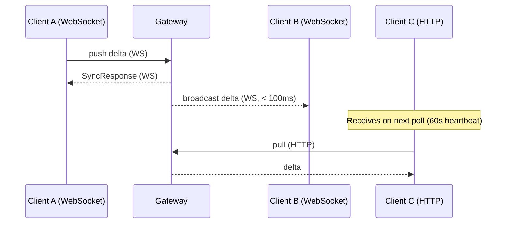

## Overview

LakeSync supports real-time delta synchronisation via WebSocket. When client A pushes deltas, all other connected clients receive them immediately via server-initiated broadcast — no polling delay. HTTP polling remains as a fallback for environments where WebSocket is unavailable.



## WebSocket Transport

The `WebSocketTransport` connects to the gateway over a persistent WebSocket using the same binary protobuf protocol as HTTP, with tag-based framing:

| Tag | Direction | Purpose |
|-----|-----------|---------|
| `0x01` | Client to server | Push deltas |
| `0x02` | Client to server | Pull deltas |
| `0x03` | Server to client | Broadcast (new deltas from other clients) |

```ts
import { WebSocketTransport } from "lakesync/client";

const transport = new WebSocketTransport({
  url: "wss://your-gateway.example.com/sync/gw-1/ws",
  token: "your-jwt-token",
  // Optional: HTTP config for checkpoint downloads
  httpConfig: {
    baseUrl: "https://your-gateway.example.com",
    gatewayId: "gw-1",
    token: "your-jwt-token",
  },
});
```

### Authentication

Browser `WebSocket` cannot set custom headers. The token is passed as a `?token=<jwt>` query parameter. Both the Cloudflare Worker and self-hosted gateway accept tokens from either the `Authorization: Bearer` header or the query parameter.

### Auto-Reconnect

On disconnect, the transport reconnects with exponential backoff (1s, 2s, 4s, ... up to 30s max). The backoff resets on successful reconnect. Call `disconnect()` to stop reconnection.

### Checkpoint Fallback

Checkpoints are large binary payloads better suited to HTTP. When `httpConfig` is provided, `checkpoint()` delegates to an internal `HttpTransport`. Without `httpConfig`, checkpoint returns `null` and the coordinator falls through to incremental pull.

## Coordinator Integration

The `SyncCoordinator` automatically detects when the transport supports real-time sync and adjusts its behaviour:

```ts
import { SyncCoordinator } from "lakesync/client";

const coordinator = new SyncCoordinator(db, transport);
coordinator.startAutoSync();
// With WebSocketTransport:
//   - Opens WebSocket connection
//   - Receives broadcasts instantly
//   - Polls every 60s as heartbeat (instead of 10s)
```

### How It Works

1. **On construction** — if the transport exposes `onBroadcast`, the coordinator registers a callback
2. **On `startAutoSync()`** — calls `transport.connect()` to open the WebSocket
3. **On broadcast** — applies deltas using the same `applyRemoteDeltas` logic as a regular pull (conflict resolution, idempotency, and `onChange` events all work identically)
4. **Polling heartbeat** — with realtime active, the polling interval increases from 10s to 60s (configurable via `realtimeHeartbeatMs`). This catches any deltas missed during brief disconnects.
5. **On `stopAutoSync()`** — calls `transport.disconnect()` to close the WebSocket

### Events

Broadcast deltas fire the same events as polled deltas:

- **`onChange`** — fires when broadcast deltas are applied locally
- **`onError`** — fires if broadcast application fails
- **`onSyncComplete`** — fires on heartbeat poll completion (not on broadcast)

## Server-Side Broadcasting

### Sync Rules Filtering

Broadcasts are filtered per-client using the same sync rules as pull requests. Each connected client's JWT claims are stored on connection. When deltas are broadcast, the server:

1. Loads the gateway's sync rules (once per broadcast, not per-client)
2. Iterates all connected WebSocket clients
3. Skips the sender (the client that pushed the deltas)
4. Applies `filterDeltas()` with each client's claims
5. Sends only matching deltas to each client

This means clients never receive deltas they wouldn't see via a regular pull.

### Gateway Server

The self-hosted gateway server (`@lakesync/gateway-server`) supports WebSocket connections on the `/sync/:gatewayId/ws` path. Broadcast happens on both HTTP push and WebSocket push paths.

### Cloudflare Workers (Durable Object)

The CF Worker gateway uses the Durable Object hibernatable WebSocket API. Connections are zero-cost when idle. Broadcast uses `ctx.getWebSockets()` to iterate all connections and `serializeAttachment`/`deserializeAttachment` to recover per-client state.

## Transport Comparison

| Feature | `HttpTransport` | `WebSocketTransport` |
|---------|-----------------|----------------------|
| Push/pull | HTTP POST | Binary WebSocket |
| Real-time broadcast | No (polling only) | Yes (server-initiated) |
| Default poll interval | 10s | 60s (heartbeat) |
| Checkpoint | Direct HTTP | Delegates to internal HTTP |
| Auto-reconnect | N/A | Exponential backoff |
| Auth | `Authorization` header | `?token=` query param |
| Offline recovery | Pull on reconnect | Pull on reconnect + broadcast on connect |

## Configuration

```ts
interface WebSocketTransportConfig {
  /** WebSocket URL, e.g. "wss://gateway.example.com/sync/my-gw/ws" */
  url: string;
  /** Bearer token (passed as ?token= query param). */
  token: string;
  /** Called when server broadcasts deltas. */
  onBroadcast?: (deltas: RowDelta[], serverHlc: HLCTimestamp) => void;
  /** Reconnect base delay in ms (default 1000). */
  reconnectBaseMs?: number;
  /** Max reconnect delay in ms (default 30000). */
  reconnectMaxMs?: number;
  /** HTTP transport config for checkpoint fallback. */
  httpConfig?: HttpTransportConfig;
}
```

```ts
// SyncCoordinator config additions
interface SyncCoordinatorConfig {
  // ... existing fields ...
  /** Polling interval when realtime transport is active (heartbeat).
   *  Defaults to 60000 (60 seconds). */
  realtimeHeartbeatMs?: number;
}
```
